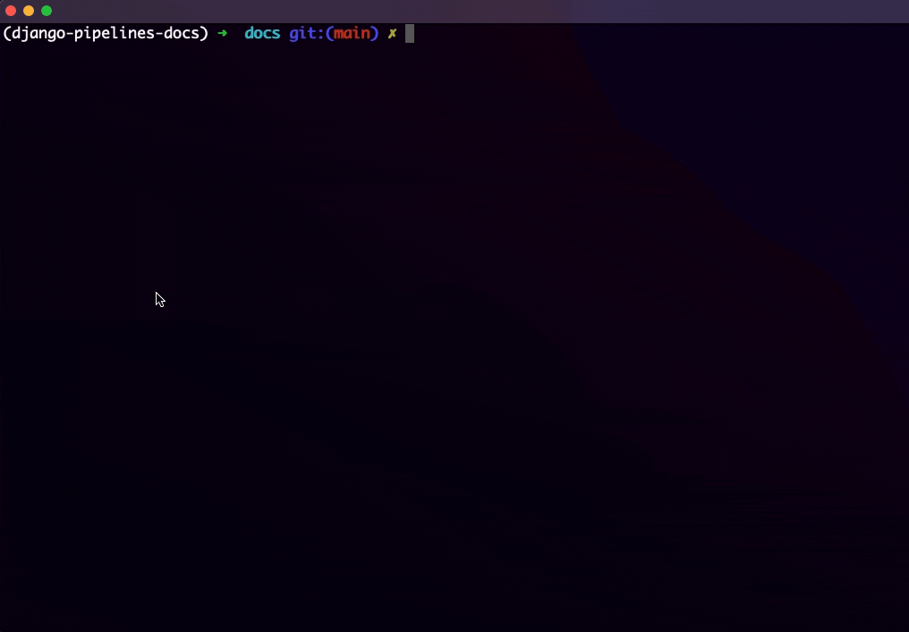
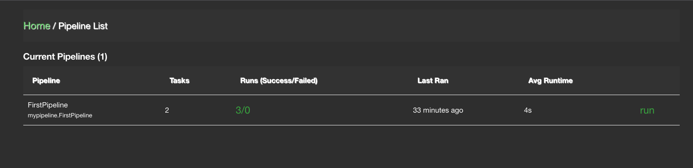
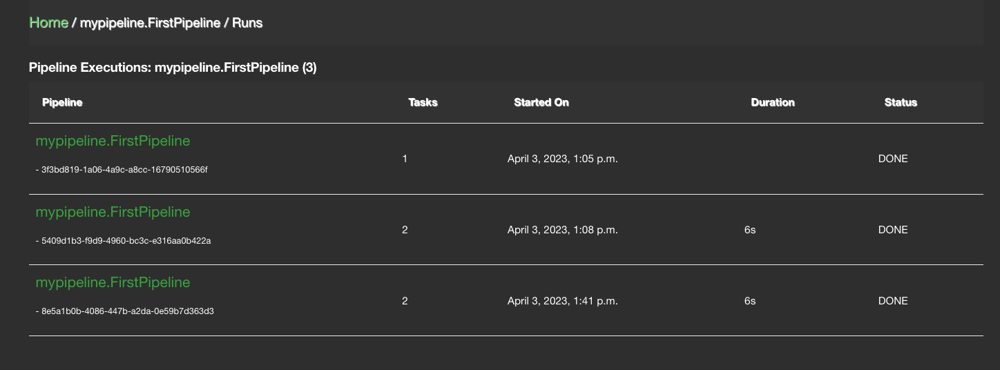
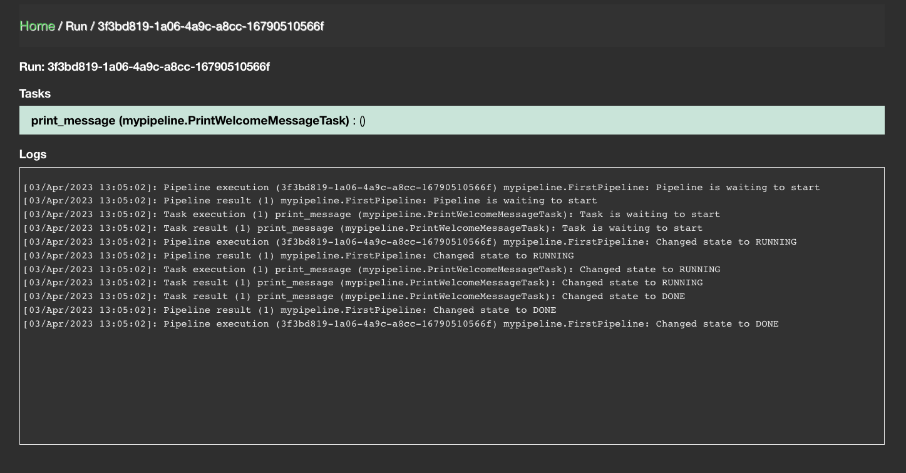

================
django-pipelines
================

Tools to help you build data pipelines in Django.

https://github.com/wildfish/django-pipelines

.. image:: https://github.com/wildfish/django-pipelines/actions/workflows/build.yml/badge.svg
    :target: https://github.com/wildfish/django-pipelines

.. image:: https://coveralls.io/repos/wildfish/django-pipelines/badge.svg?branch=master&service=github
    :target: https://coveralls.io/github/wildfish/django-pipelines?branch=main

Features
========

* Data pipeline management with configurable runners (celery support included), reporters and management UI.
* Supports Django 3.2 to 4.2, on Python 3.9+.

See the `full documentation <https://django-pipelines.readthedocs.io>`_ for details
of how django-pipelines works.

.. inclusion-quickstart-do-not-remove

==========
Quickstart
==========

This is a quickstart guide for creating a simple pipeline.

Project Setup
=============

We recommend using a virtual environment such as `pyenv <https://github.com/pyenv/pyenv>`_ to manage your
dependencies and Python versions. From this point we assume you have a environment setup, activated & pip installed.

Create a new Django project::

    # Create the project directory
    mkdir demo
    cd demo

    # Install
    pip install django-pipelines

    # Set up a new project
    django-admin startproject demo .
    cd demo
    django-admin startapp mypipeline

Settings
========
Firstly we need to add :code:`pipelines` and the new app :code:`demo.mypipeline` to :code:`INSTALLED_APPS` in :code:`demo/settings.py`::

    INSTALLED_APPS = [
        ...
        "django.contrib.humanize",
        "pipelines",
        "demo.mypipeline",
    ]

Migrate
=======
Finally we sync the database by running::

    cd ..
    python manage.py migrate

Creating a Pipeline
-------------------

Now the project is setup we are ready to start building our first pipeline.
The first thing we need to do is setup a pipeline definition.

Create a new file :code:`demo/mypipeline/pipelines.py`

Note: It is important that you name the file :code:`pipelines.py` as this is used by the registry to discover your pipelines::

    from pipelines.base import Pipeline, Task

    class PrintWelcomeMessageTask(Task):
        title = "Print Welcome Message"

        def run(self, pipeline_id, run_id, cleaned_data):
            print("Hello World!")

    class FirstPipeline(Pipeline):
        print_message = PrintWelcomeMessageTask()

        class Meta:
            title = "First pipeline"

Here we are creating a pipeline :code:`FirstPipeline` with one task :code:`print_message`.   Pipelines can
have multiple tasks and we will show this in the next section.

All Pipelines must inherit from the base class :code:`Pipeline`.

We have also defined our first task: :code:`PrintWelcomeMessageTask`.  Here we are just printing "Hello World!" but
can make this as complex as you require.  All tasks should inherit from :code:`Task` and have a :code:`run` method defined.

And we're done.

Running the pipeline
---------------------
The quickest way to run a pipeline for testing is by running the management command::

    python manage.py pipelines

After running this you should see a list of pipelines, numbered, and a prompt of 'Which pipelines would you like to start?'::

    Pipelines:
    1). demo.mypipeline.pipelines.FirstPipeline:

    Which pipelines would you like to start?

Type 1 to run FirstPipeline.  You will now be shown a list of tasks the pipeline will run along with a prompt for how you wish to run it::

    demo.mypipeline.pipelines.FirstPipeline will run the following tasks:
    1). print_message: Print Message

    Run [r], Run eager [e] or Cancel [c]?

You have the option to run the pipeline in eager mode or against the configured runner.
Since we have not set a custom up we will run it in Eager mode by typing e.  You should then see::

    Hello World!
    Pipeline Completed

As you can see the Hello World! message has been printed to the console just as we defined in the Task.

Adding another Task
===================

To complete this example we will add another task to our pipeline.  Update :code:`demo/mypipeline/pipelines.py`::

    import time
    from pipelines.base import Pipeline, Task

    class PrintWelcomeMessageTask(Task):
        title = "Print Welcome Message"

        def run(self, pipeline_id, run_id, cleaned_data):
            print("3 Times Table:")

    class PrintNumbersTask(Task):
        title = "Print 3 times table"

        def run(self, pipeline_id, run_id, cleaned_data):
            for i in range(1, 13):
                print(f"{i} x 3 = {i*3}")
                time.sleep(0.5)

    class FirstPipeline(Pipeline):
        print_message = PrintWelcomeMessageTask()
        numbers_task = PrintNumbersTask(config={"parents": ["print_message"]})

        class Meta:
            title = "First pipeline"

We have now defined a second task :code:`PrintNumbersTask` which prints the 3 times table from 1-12.
We also include a slight delay (0.5 seconds) between iterations so you can see it better when running the pipeline.

We have added this new task to our pipeline and specified that this should run after :code:`print_message` by adding
a config variable to the task instance :code:`config={"parents": ["print_message"]}`.  Adding this allows us to define
the exact order each task should be ran.

If we again run the pipeline using the management command we should now see:

Monitoring Pipelines
====================

To wire up the pipeline monitoring views we need to add them to the urls file.  In :code:`demo/urls.py` add::

    from django.contrib import admin
    from django.urls import include, path

    urlpatterns = [
        path('admin/', admin.site.urls),
        path('pipelines/', include('pipelines.urls')),
    ]

In order to view these pages you need to be logged in as a staff user.  So first lets create a superuser for our site::

    python manage.py createsuperuser

After completing this you will have an account setup with superuser access, so lets run our site::

    python manage.py runserver

We need to login before we can view any of the pipeline pages so navigate to http://127.0.0.1:8000/admin/ and login
using the details you entered when creating the superuser.

Once logged in you can access the pipeline monitoring pages at: http://127.0.0.1:8000/pipelines/

This list shows the each pipeline, how many tasks are associated with each, how may times it ran, including which
have passed and which have failed, when it was last ran, and the average amount of time it took to run.
You also have the option to run the pipeline.

If you click on the runs cell you will be taken to the pipeline execution page.

This shows details of each execution of the pipeline including: the pipeline and task count, when it was started,
how long it took to run and what was the status of the pipeline.

To see further details of a particular execution, click on the pipeline name.

This details view shows a breakdown of each task which was ran including: the task name, status, and when it
started finished and duration.  You also have the option to rerun the individual task.

The logs recorded during the pipeline run is also shown on this page.  This can be useful if you are trying to
debug why a pipeline is not running correctly.

.. inclusion-quickstart-end-do-not-remove